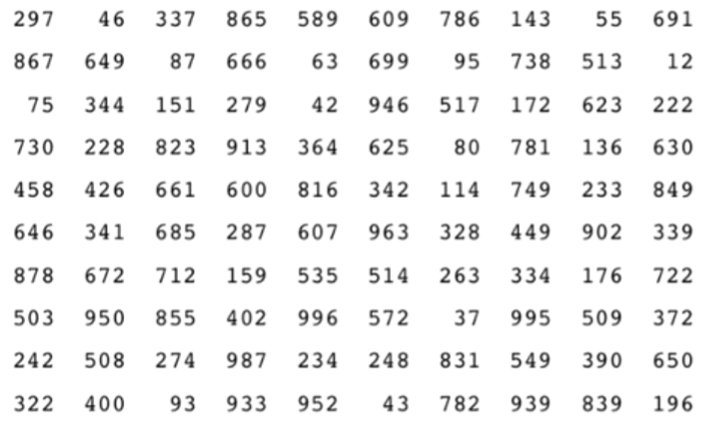
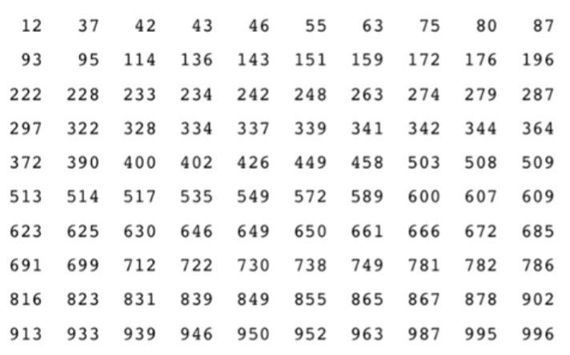

# 1강: 안녕, 자료구조 & 알고리즘!

## 파이썬 데이터타입
1. 문자열(str) `"This is a string"`
2. 리스트(list) `[5, 9, 2, 7]`
3. 사전(dict) `{'a': 6, 'bc': 4}`
4. 순서쌍(tuple), 집합(set), ...

<br>

## 자료구조를 왜 알아야 하는가
- 기본적인 데이터 타입으로 해결할 수 없는 문제가 있다.
```python
import time

n = int(input("Number of elements: "))
haystack = [k for k in range(n)]

print("Searching for the maximum value...")

ts = time.time()
maxumum = max(haystack)
elapsed = time.time() - ts

print("Maximum element = %d, Elapsed time = %.2f" % (maxumum, elapsed))
```
▷ `list` 타입에서 최대값을 확인하려면 리스트 내 객체를 모두 뒤져봐야 함<br>
▷ 갯수에 비례하는 시간이 소요<br>
▷ 원하는 알고리즘에 맞는 자료구조를 만들거나 사용하게 되면 소요되는 시간을 단축할 수 있음<br>
: "내가 사용하려는 자료구조가 어떠한 성질을 가져야 하는가"
> *자료구조: 데이터에 대해 행할 수 있는 연산들이 존재하는 무엇인가의 구조*

<br>

## 알고리즘(Algorithm) 이란?
> 주어진 문제의 해결을 위한 자료구조와 연산 방법에 대한 선택

### 549 찾기




* 크기에 따라 오름차순으로 정렬하게 되면 보다 수월하게 찾을 수 있음.

▷ 해결하고자 하는 문제에 따라 (응용 종류와 범위에 따라) 최적의 해법은 서로 다름.<br>
▷ 이 선택을 어떻게 해야 하느냐를 알기 위해 자료구조를 이해해야 함.<br>

<br>

## 실습문제 (01) 리스트 원소 합
**문제 설명**<br>
- 입력으로 주어지는 리스트 x 의 첫 원소와 마지막 원소의 합을 리턴하는 함수 solution() 을 완성하세요.

**제출 답안**<br>
```python
def solution(x):
    answer = x[0] + x[len(x) - 1]
    return answer
```