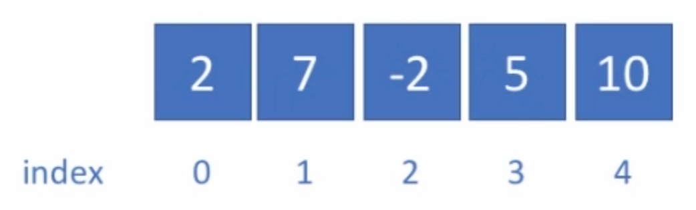
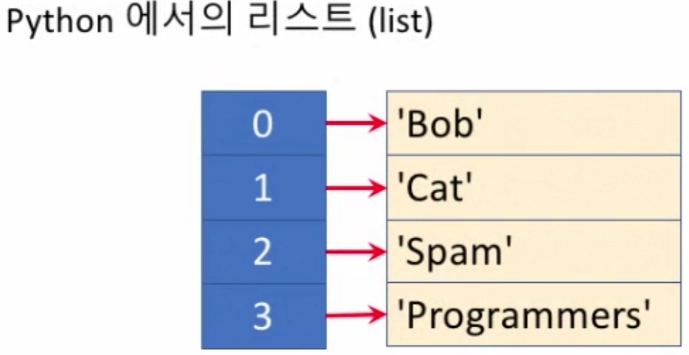
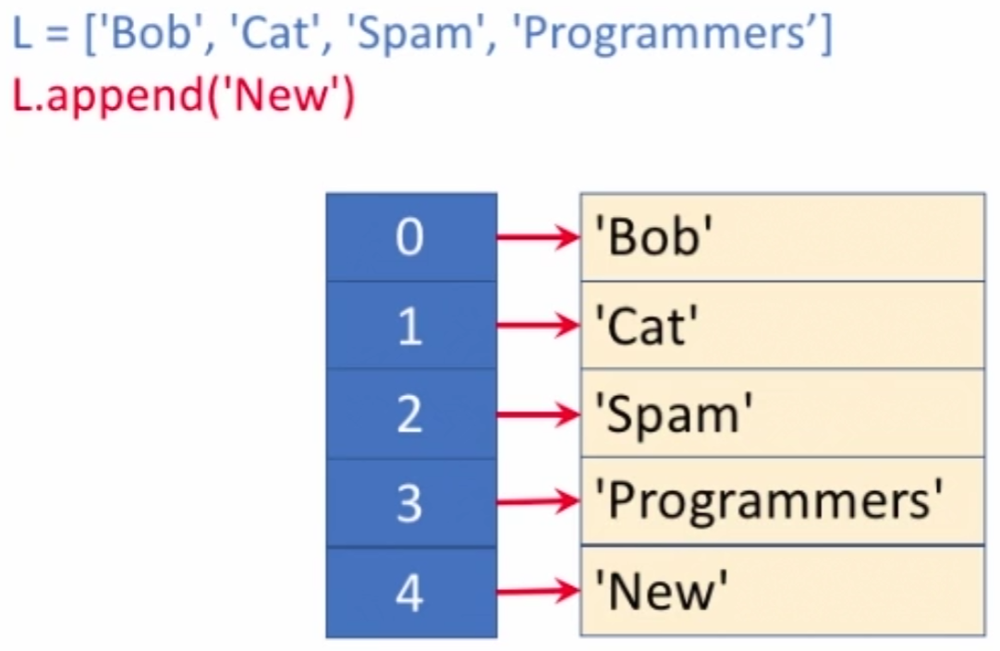
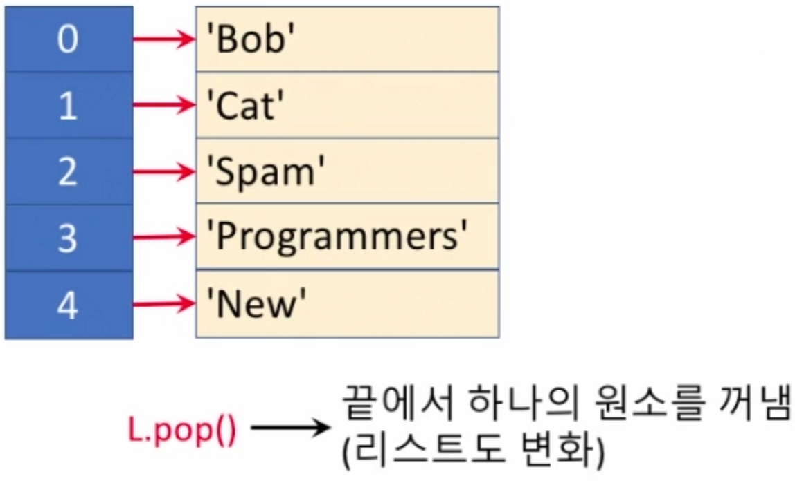
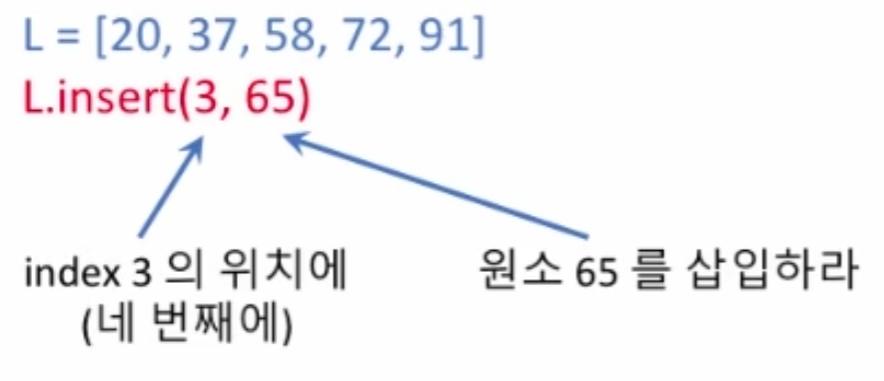
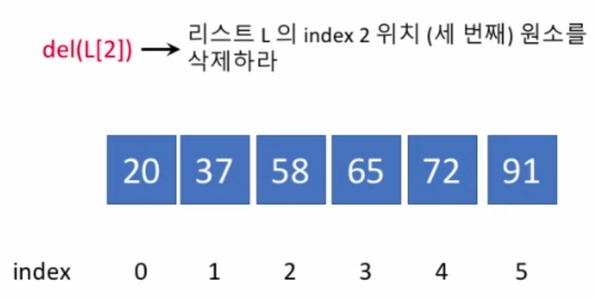
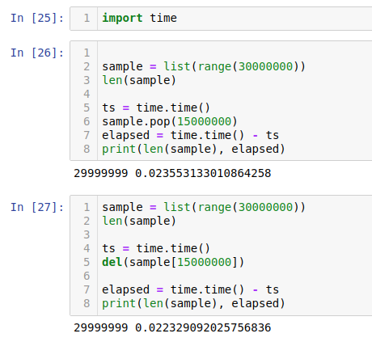
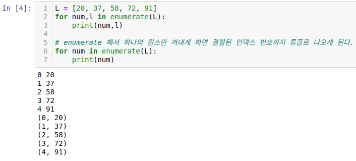

#선형 배열 (Linear Arrays)
___
> 선형 배열은 데이터들이 선 (line) 처럼 일렬로 늘어선 형태<br>

▷ 보통 프로그래밍에서 배열 (array) 이라고 하면 같은 종류의 데이터가 줄지어 늘어서 있는 것을 의미<br>
▷ Python 에서는 서로 다른 종류의 데이터 또한 줄세울 수 있는 리스트 (list) 라는 데이터형이 존재<br>

*배열(array)과 리스트(list)는 개념적인 구조가 유사*<br>
데이터를 늘어놓은 모양새를 말할 때는 배열 (array), Python 의 데이터형을 가리킬 때에는 리스트 (list) 라는 용어를 사용




```python
L = ['Bob', 'Cat', 'Spam', 'Programmers']
```

또한, 제 7 강부터는 "연결 리스트 (linked list)" 라는 용어가 등장하게 되는데, 이것과는 구별되어야 함.


###시간복잡도
<table>
  <tr>
    <th colspan="2" align="center" style="bold">자주 사용하는 시간 복잡도 표기</th>
  </tr>
  <tr>
    <td align="center">O(1)</td>
    <td align="center">상수 시간(Constant Time)</td>
  </tr>
  <tr>
    <td align="center">O(log n)</td>
    <td align="center">로그 시간(대수 시간, Logarithmic Time)</td>
  </tr>
  <tr>
    <td align="center">O(n)</td>
    <td align="center">선형 시간(Linear Time)</td>
  </tr>
  <tr>
    <td align="center">O(n log n)</td>
    <td align="center">로그 선형 시간(Log-linear Time)</td>
  </tr>
  <tr>
    <td align="center">O(n^2)</td>
    <td align="center">제곱 시간(Quadratic Time)</td>
  </tr>
  <tr>
    <td align="center">O(n^3)</td>
    <td align="center">세제곱 시간(Cubic Time)</td>
  </tr>
  <tr>
    <td align="center">O(2^n)</td>
    <td align="center">지수 시간(Exponential Time)</td>
  </tr>
</table>

<br>

##Python 리스트에 활용할 수 있는 연산들
___
###리스트 길이과 관계 없이 실행 결과를 보게되는 연산들
- 원소 덧붙이기 `.append()`


- 원소 하나를 꺼내기 `.pop()`

```markdown
L.pop()
>>>'New'
L
>>>['Bob', 'Cat', 'Spam', 'Programmers']
```

###리스트의 길이에 비례해서 실행 시간이 걸리는 연산들
- 원소 삽입하기 `.insert()`


- 원소 삭제하기 `.del()`


▷ 위 연산들을 처리하기 위하여 배열 요소의 위치를 재조정하게 됨으로써 리스트 길이에 비례하여 실행시간이 길어짐.

#### *cf) del 과 pop 둘 중에 뭐가 더 빠를까*


▷ pop()은 지워진 인덱스의 값을 반환하지만 del 은 반환하지 않음.<br>
▷ 이 차이로 인해 미세하지만 del이 pop() 보다 수행속도가 빠름.<br>
▷ 또한 remove()와 동일하게 pop() 과 del은 특정 인덱스를 삭제한 다음 리스트를 재조정


###추가 다른 연산
- 원소 탐색하기: `.index()`

▷ `index()`는 상수 시간복잡도를 가지는 연산

<br>

## 실습문제 (01) 정렬된 리스트에 원소 삽입
___
**문제 설명**<br>
- 리스트 L 과 정수 x 가 인자로 주어질 때, 리스트 내의 올바른 위치에 x 를 삽입하여 그 결과 리스트를 반환하는 함수 solution 을 완성하세요.
- 인자로 주어지는 리스트 L 은 정수 원소들로 이루어져 있으며 크기에 따라 (오름차순으로) 정렬되어 있다고 가정합니다.
- 예를 들어, L = [20, 37, 58, 72, 91] 이고 x = 65 인 경우, 올바른 리턴 값은 [20, 37, 58, 65, 72, 91] 입니다.
- 힌트: 순환문을 이용하여 올바른 위치를 결정하고 insert() 메서드를 이용하여 삽입하는 것이 한 가지 방법입니다.
- 주의: 리스트 내에 존재하는 모든 원소들보다 작거나 모든 원소들보다 큰 정수가 주어지는 경우에 대해서도 올바르게 처리해야 합니다.

**제출 답안**<br>
```python
def solution(L, x):
    for i in L:
        if i > x:
            L.insert(L.index(i), x)
            break
        if x > max(L):
            L.append(x)
            break
    answer = L
    return answer
```

## 실습문제 (02) 리스트에서 원소 찾아내기
___
**문제 설명**<br>
- 인자로 주어지는 리스트 L 내에서, 또한 인자로 주어지는 원소 x 가 발견되는 모든 인덱스를 구하여 이 인덱스들로 이루어진 리스트를 반환하는 함수 solution 을 완성하세요.
- 리스트 L 은 정수들로 이루어져 있고 그 순서는 임의로 부여되어 있다고 가정하며, 동일한 원소가 반복하여 들어 있을 수 있습니다. 이 안에 정수 x 가 존재하면 그것들을 모두 발견하여 해당 인덱스들을 리스트로 만들어 반환하고, 만약 존재하지 않으면 하나의 원소로 이루어진 리스트 [-1] 를 반환하는 함수를 완성하세요.
- 예를 들어, `L = [64, 72, 83, 72, 54]` 이고 `x = 72` 인 경우의 올바른 리턴 값은 `[1, 3]` 입니다.
- 또 다른 예를 들어, `L = [64, 72, 83, 72, 54]` 이고 `x = 83` 인 경우의 올바른 리턴 값은 `[2]` 입니다.
- 마지막으로 또 다른 예를 들어, `L = [64, 72, 83, 72, 54]` 이고 `x = 49` 인 경우의 올바른 리턴 값은 `[-1]` 입니다.
- 힌트 1: 리스트의 `index()` 메서드와 리스트 슬라이싱을 활용하는 것이 한 가지 방법이 됩니다. 리스트 슬라이싱은 아래와 같이 동작합니다.
- L = [6, 2, 8, 7, 3] 인 경우<br>
L[1:3] = [2, 8]<br>
L[2:] = [8, 7, 3]<br>
L[:3] = [6, 2, 8]<br>
- 힌트 2: 리스트의 `index()` 메서드는, 인자로 주어지는 원소가 리스트 내에 존재하지 않을 때 `ValueError` 를 일으킵니다. 이것을 try ... except 로 처리해도 되고, "if x in L" 과 같은 조건문으로 특정 원소가 리스트 내에 존재하는지를 판단해도 됩니다.

**제출 답안**<br>
```python
def solution(L, x):
    answer = []
    if x in L:
        for idx, num in enumerate(L):
            if num == x:
                answer.append(idx)
    else:
        answer.append(-1)
    return answer
```

