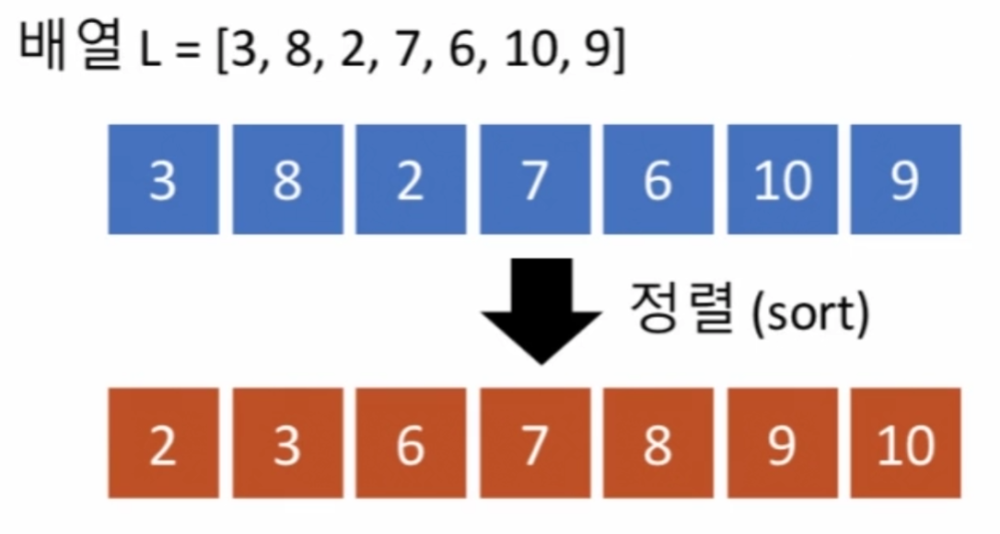
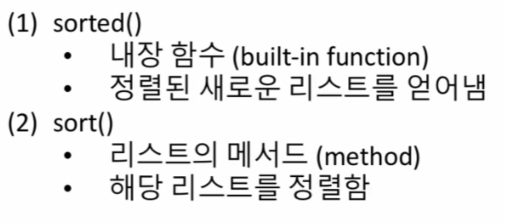
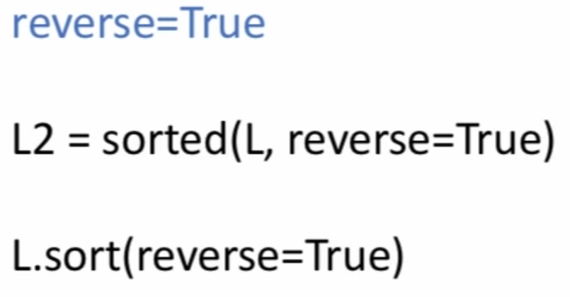
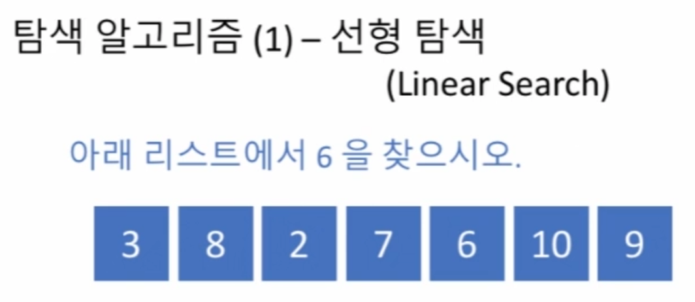
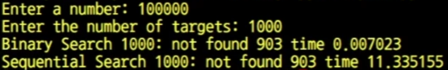

# 3강: 정렬(Sort), 탐색(Search)

## 배열 - 정렬 (sort) 과 탐색 (search)
▷ 정렬과 탐색은 많은 응용에 적용되는, 알고리즘들 중에서도 가장 널리 알려져 있으며 활용도도 높은 것들

▷ 정렬과 탐색을 위한 여러 자료 구조와 알고리즘들이 있지만, 간단하게 선형 배열을 대상으로 정렬과 탐색의 기초를 학습. 


### 정렬(sort)
▷ 복수의 원소로 주어진 데이터를 정해진 기준에 따라 새로 늘어놓는 작업



▷ Python 의 리스트 (list) 를 이용한다면, 직접 정렬 알고리즘을 구현할 필요가 없습니다. 왜냐면 이미 리스트 (list) 에 내장된 정렬 기능이 있기 때문인데요, 아래와 같은 서로 다른 두 방법이 대표적


- 파이썬 내장 함수 `sorted()`
- 리스트에 쓸 수 있는 메서드 `.sort()`

> 정렬 순서를 바꾸려면 아래 방법을 사용



#### 수치(number) 가 아닌 데이터형의 정렬
▷ 이 경우에는 문자열을 사전에 등장하는 순서에 따라 정렬<br>
▷ 문자열의 길이가 더 길다고 해서 더 큰 문자로 취급하는 것이 아님<br>
▷ 단, 차이가 있다면 영어사전에는 대소문자가 섞인 순서로 등장하지만 Python 문자열은 대문자가 소문자에 비해서 무조건 우선<br>
▷ 그렇다면 만약 대소문자 구별을 무시하고 순전히 알파벳 순서에 따라 정렬하려면?<br>
-> 정렬에 이용하는 key 사용
```
>>> L = ['abcd', 'xyz', 'spam']
>>> sorted(L, key=lambda x: len(x)]
['xyz', 'abcd', 'spam']

>>> L = ['spam', 'xyz', 'abcd']
>>> sorted(L, key=lambda x: len(x)]
['spam', 'xyz', 'abcd']
```

▷ 사전 (dictionary) 타입 정렬 예시
```python
L = [{'name':'John', 'score': 83},
     {'name':'Paul', 'score': 92}]
L.sort(key=lambda x: x['score'], reverse=True)
```

### 탐색(search)
복수의 원소로 이루어진 데이터에서 특정 원소를 찾아내는 작업입니다. 탐색에도 여러 가지 방법이 있지만, 아주 기본적인 두 가지를 소개합니다.

- 선형 탐색 (linear search; O(n)), 또는 순차 탐색 (sequential search): 순차적으로 모든 요소들을 탐색하여 원하는 값을 찾아냄. 배열의 길이에 비례하는 시간이 걸리므로, 최악의 경우에는 배열에 있는 모든 원소를 다 검사해야 할 수 있음



```python
def linear_search(L, x):
    i = 0
    while i < len(L) and L[i] != x:
        i += 1
    if i < len(L):
        return i
    else:
        return -1
```

- 이진 탐색 (binary search; O(log n)): 탐색하려는 배열이 이미 정렬되어 있는 경우에만 적용가능. 배열의 가운데 원소와 찾으려 하는 값을 비교하면, (크기 순으로 정렬되어 있다는 성질을 이용하면) 왼쪽에 있을지 오른쪽에 있을지를 알 수 있음(만약 있긴 있다면). 그러면, 적어도 반대쪽에 없는 것은 확실하므로, 배열의 반을 탐색하지 않고 버릴 수 있음(한번 실행 시 리스트가 절반씩 줄어듦으로 시간복잡도는 O(log n)).

```python
lower = 0
upper = len(L) - 1
idx = -1
while lower <= upper:
    middle = (lower + upper) // 2
    if L[middle] == target:
        ...
    elif L[middle] < target:
        lower = ...
    else:
        upper = ...
```

### 선형탐색과 이진탐색의 성능 비교

▷ 이진탐색은 항상 정렬이 선행되어야 함으로 적절한 알고리즘 선택이 중요함.

## 실습문제 (03) 이진탐색
**문제 설명**<br>
- 리스트 L 과, 그 안에서 찾으려 하는 원소 x 가 인자로 주어질 때, x 와 같은 값을 가지는 원소의 인덱스를 리턴하는 함수 solution() 을 완성하세요. 만약 리스트 L 안에 x 와 같은 값을 가지는 원소가 존재하지 않는 경우에는 -1 을 리턴합니다. 리스트 L 은 자연수 원소들로 이루어져 있으며, 크기 순으로 정렬되어 있다고 가정합니다. 또한, 동일한 원소는 두 번 이상 나타나지 않습니다.
- 예를 들어, `L = [2, 3, 5, 6, 9, 11, 15], 
x = 6` 의 인자들이 주어지면, `L[3] == 6` 이므로 `3` 을 리턴해야 합니다.
- 또 다른 예로, `L = [2, 5, 7, 9, 11], x = 4`로 주어지면, 리스트 L 내에 `4` 의 원소가 존재하지 않으므로 `-1` 을 리턴해야 합니다.
- 이 연습문제에서는 알고리즘의 효율성도 평가합니다. 만약 순차 (선형) 탐색 알고리즘을 구현하는 경우에는 제한 시간 요구사항을 만족하지 못하여 효율성 테스트 케이스들을 통과하지 못할 수도 있습니다.
- 참고: (2021년 8월 2일) 아래 질문을 검토하다가 테스트 케이스에 추가되면 좋을 것으로 판단한 경우가 있어서 "예시 테스트 케이스" 와 "정확성 테스트 케이스" 를 추가하였습니다.
(https://programmers.co.kr/questions/19525)

**제출 답안**<br>
```python
def solution(L, x):
    answer = -1
    if len(L) > 0:
        lower = 0
        upper = len(L) - 1
        while lower <= upper:
            mid = (lower + upper) // 2
            if x < L[mid]:
                upper = mid - 1
            elif x > L[mid]:
                lower = mid + 1
            elif x == L[mid]:
                answer = mid
                break
    return answer
```