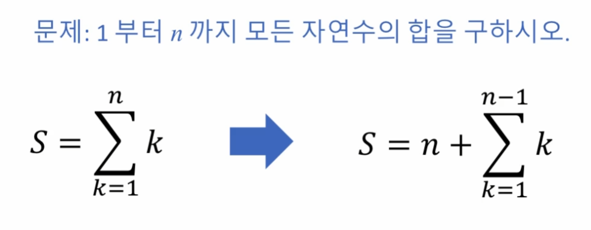
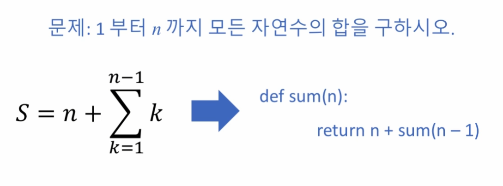
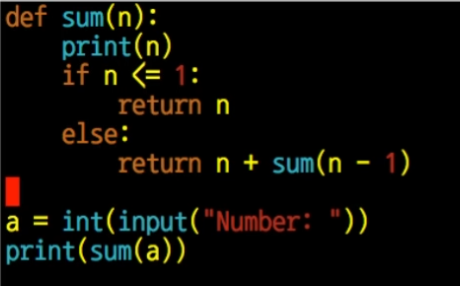
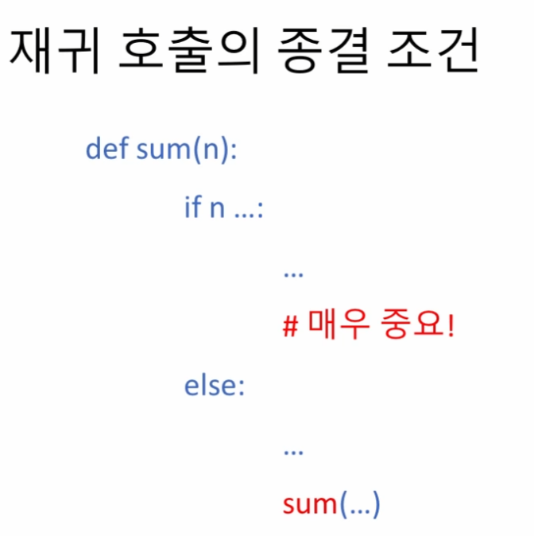
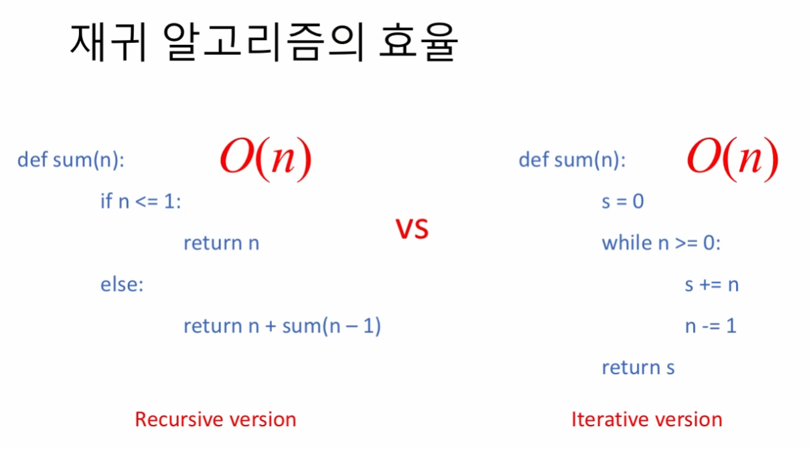
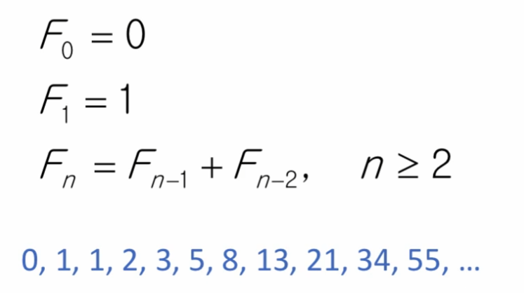

# 재귀 알고리즘 (recursive algorithms) - 기초

> 주어진 문제가 있을 때, 이것을 같은 종류의 보다 쉬운 문제의 답을 이용해서 풀 수 있는 성질을 이용해서, 같은 알고리즘을 반복적으로 적용함으로써 풀어내는 방법

▷ 일반적으로 재귀함수 (Recursive Functions)를 사용하여 구현하는 알고리즘을 의미.
> 재귀함수: 하나의 함수에서 자신을 다시 호출하여 작업을 수행하는 함수

<br>
 
## 자연수의 합 구하기 (재귀 알고리즘의 간단한 예)
___
▷ 1 부터 n 까지 모든 자연수의 합을 구하는 문제 (`sum(n)`)는, 1 부터 n - 1 까지의 모든 자연수의 합을 구하는 문제 (`sum(n - 1)`)를 풀고, 여기에 n 을 더해서 그 답을 찾을 수 있음<br>
=> `sum(n) = sum(n - 1) + n`



## 재귀 호출의 종결 조건
___

cf) Maximum recursion depth exceeded


## 재귀 알고리즘의 효율
___
재귀 알고리즘은 항상 Counter Part에 해당하는 반복문 알고리즘이 존재함.<br>

재귀 알고리즘은 함수를 계속 호출해야하는 부분이 존재하므로 효율성은 떨어질 수 있음.


## 추가 예제
___
```python
def what(n):
    if n <= 1:
        return 1
    else:
        return n * what(n - 1)
```
==> n!를 구하는 재귀 함수


## 실습문제 (04) 피보나치(Fibonacci) 수열

___
**문제 설명**<br>
인자로 0 또는 양의 정수인 x 가 주어질 때, Fibonacci 순열의 해당 값을 구하여 반환하는 함수 solution() 을 완성하세요.

Fibonacci 순열은 아래와 같이 정의됩니다.
```
F0 = 0
F1 = 1
Fn = Fn - 1 + Fn - 2, n >= 2
```

재귀함수 작성 연습을 의도한 것이므로, 재귀적 방법으로도 프로그래밍해 보고, 반복적 방법으로도 프로그래밍해 보시기 바랍니다.

**제출 답안**<br>
```python
def solution(x):
    if x == 0:
        return 0
    elif x == 1:
        return 1
    else:
        return solution(x - 1) + solution(x - 2)
```
```python
def solution(x):
    n = 1
    m = 1
    if x == 1 or x == 2:
        return 1
    
    for _ in range(1, x):
        n, m = m, n + m
    return n
```

ref) [피보나치 수열 구현 방법 7가지](https://velog.io/@cha-suyeon/python-%ED%94%BC%EB%B3%B4%EB%82%98%EC%B9%98-%EC%88%98%EC%97%B4-%EB%A7%8C%EB%93%A4%EA%B8%B0-%EC%A0%90%ED%94%84%ED%88%AC%ED%8C%8C%EC%9D%B4%EC%8D%AC-%EC%A2%85%ED%95%A9%EB%AC%B8%EC%A0%9C-5%EB%B2%88)