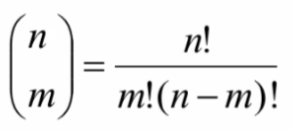
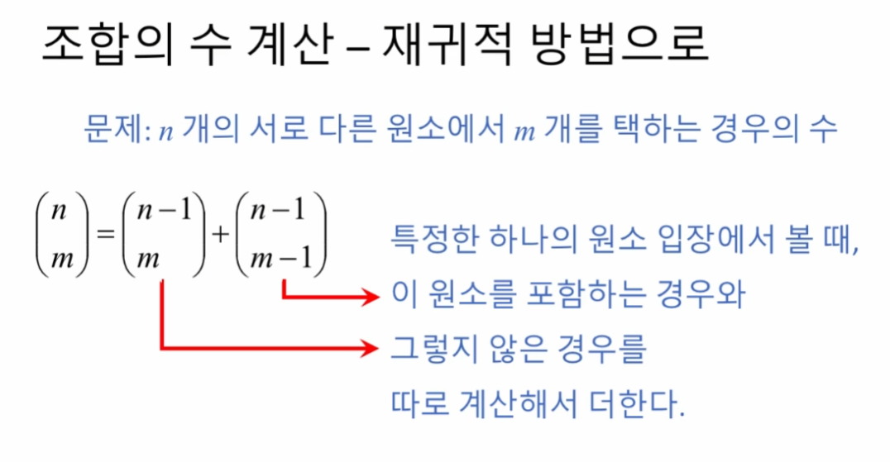
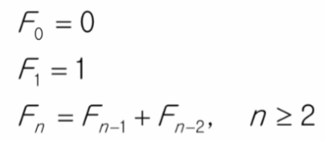
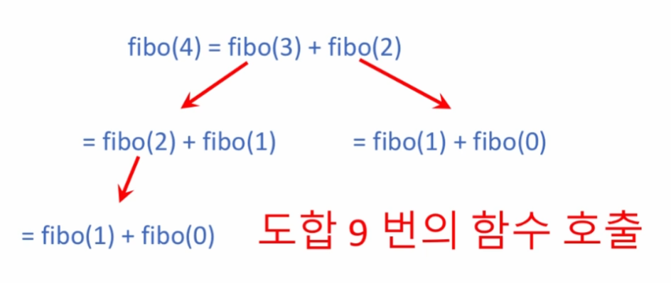
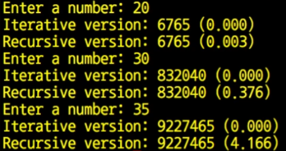

# 5강: 재귀 알고리즘 (recursive algorithms) - 응용
다음과 같은 문제들을 재귀 알고리즘으로 해석
- 조합의 수 (n 개의 서로 다른 원소에서 m 개를 택하는 경우의 수) 구하기
- 하노이의 탑 (크기 순서로 쌓여 있는 원반을 한 막대에서 다른 막대로 옮기기)
- 피보나치 수열

## 조합의 수 계산
문제: n개의 서로 다른 원소에서 m개를 택하는 경우의 수

```python
from math import factorial as f

def combi(n, m):
    return f(n) / (f(m) * f(n - m))
```

```python
def combi(n, m):
    if n == m:
        return 1
    elif m == 0:
        return 1
    else:
        return combi(n - 1, m) + combi(n - 1, m - 1)

```

## 하노이의 탑

```python
# 입력: 옮기려는 원반의 개수 n
# 옮길 원반이 현재 있는 출발점 기둥 from_pos
# 원반을 옮길 도착점 기둥 to_pos
# 옮기는 과정에서 사용할 보조 기둥 aux_pos
# 출력: 원반을 옮기는 순서

def hanoi(n, from_pos, to_pos, aux_pos):
    if n == 1:  # 한개 원반은 그냥 옮기면 됨
        print(from_pos, "→", to_pos)
        return
    
    # 원반 n-1개를 aux_pos로 이동(to_pos를 보조기둥으로 사용)
    hanoi(n - 1, from_pos, aux_pos, to_pos)
    
    # 가장 큰 원반을 목적지로 이동
    print(from_pos, "→", to_pos)
    
    # aux_pos에 있는 원반 n-1개를 목적지로 이동(from_pos를 보조기둥으로 사용)
    hanoi(n - 1, aux_pos, to_pos, from_pos)


################## 실행코드
print("n = 1")
hanoi(1, 1, 3, 2)  # 1개의 원반을 1번 기둥에서 3번 기둥으로 옮기되 2번 기둥을 보조기둥으로 사용

print("n = 2")
hanoi(2, 1, 3, 2)  # 2개의 원반을 1번 기둥에서 3번 기둥으로 옮기되 2번 기둥을 보조기둥으로 사용

print("n = 3")
hanoi(3, 1, 3, 2)  # 3개의 원반을 1번 기둥에서 3번 기둥으로 옮기되 2번 기둥을 보조기둥으로 사용
```
- 핵심은 제일 큰 원반을 제외한 나머지 원반들을 보조 기둥으로 보내는 것 (재귀로 구현)
- 그 다음 시작 기둥에 남은 제일 큰 원반이 최종 기둥으로 간다는 것 (print로 구현)
- 보조 기둥에 있는 원반들(n-1개)은 그대로 목표기둥으로. (다시 재귀로 구현) 


## 재귀 알고리즘의 효율
### 피보나치 수열 예시

```python
def fibo(n):
    if n <= 1:
        return n
    return fibo(n - 1) + fibo(n - 2)
```


### 효율 비교 구현
```python
import time
def recursive(n): 
    if n <= 1:
        return n
    else:
        return recursive(n - 1) + recursive(n - 2)

def iterative(n):
    if n <= 1:
        return n
    else:
        i = 2
        t0 = 0
        t1 = 1
        while i <= n:
            t0, t1 = t1, t0 + t1
        return t1

##################################
while True:
    nbr = int(input("Enter a Number: "))
    if nbr == -1:
        break
    ts = time.time()
    fibo = iterative(nbr)
    ts = time.time() - ts
    print("Iterative version: %d (%.3f)" % (fibo, ts))
    ts = time.time()
    fibo = recursive(nbr)
    ts = time.time() - ts
    print("Recursive version: %d (%.3f)" % (fibo, ts))
```



## 실습문제 (05) 재귀적 이진탐색
**문제 설명**<br>
- 리스트 `L` 과, 그 안에서 찾으려 하는 원소 `x` 가 인자로 주어지고, 또한 탐색의 대상이 되는 리스트 내에서의 범위 인덱스가 `l` 부터 `u` 까지로 (인자로) 정해질 때, `x` 와 같은 값을 가지는 원소의 인덱스를 리턴하는 함수 `solution()` 을 완성하세요.
- 만약 리스트 `L` 안에 `x` 와 같은 값을 가지는 원소가 존재하지 않는 경우에는 `-1` 을 리턴합니다.
- 리스트 `L` 은 자연수 원소들로 이루어져 있으며, 크기 순으로 정렬되어 있다고 가정합니다.
- 또한, 동일한 원소는 두 번 이상 나타나지 않습니다.
- 인덱스 범위를 나타내는 `l` 과 `u` 가 인자로 주어지는 이유는, 이 함수를 재귀적인 방법으로 구현하기 위함입니다.
- 빈 칸에 알맞은 내용을 채워서 재귀 함수인 `solution()` 을 완성하세요.

- 예를 들어,
`L = [2, 3, 5, 6, 9, 11, 15], 
x = 6, 
l = 0, 
u = 6` 의 인자들이 주어지면, `L[3] == 6` 이므로 `3` 을 리턴해야 합니다.

- 또 다른 예로,
`L = [2, 5, 7, 9, 11], 
x = 4, 
l = 0, 
u = 4` 로 주어지면, 리스트 `L` 내에 `4` 의 원소가 존재하지 않으므로 `-1` 을 리턴해야 합니다.

- 2021년 9월 5일, 아래 질문에 의하여 테스트 케이스의 미비점이 드러났고, 보완하기 위하여 테스트 케이스 하나 (정확성 테스트 케이스 5번) 가 추가되었습니다.

```
def solution(L, x, l, u):
    if ___________:
        return -1
    mid = (l + u) // 2
    if x == L[mid]:
        return mid
    elif x < L[mid]:
        return ___________
    else:
        return ___________
        
```

**제출 답안**<br>
```python
def solution(L, x, l, u):
    if l > u:
        return -1
    mid = (l + u) // 2
    if x == L[mid]:
        return mid
    elif x < L[mid]:
        return solution(L, x, l, mid - 1)
    else:
        return solution(L, x, mid + 1, u)
```