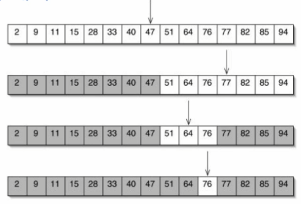
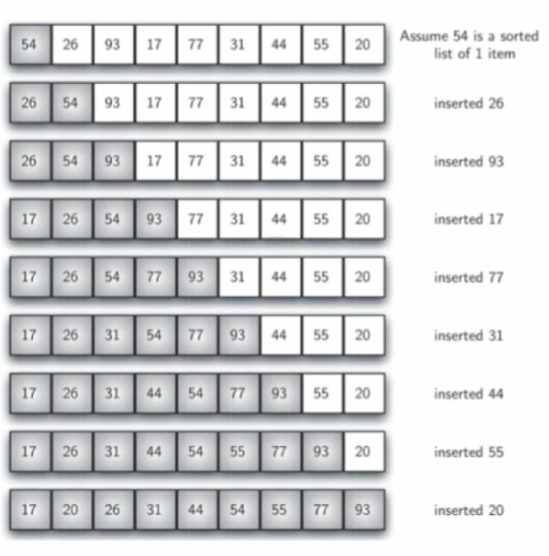
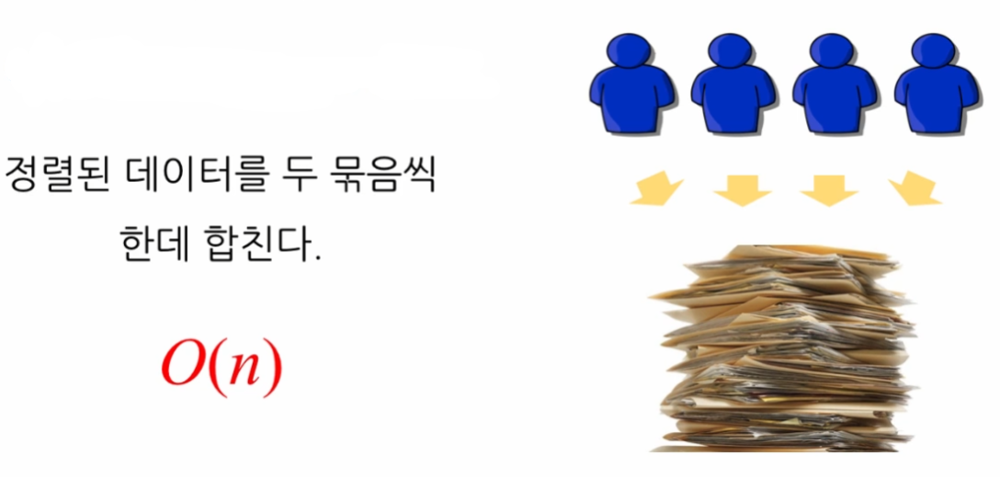
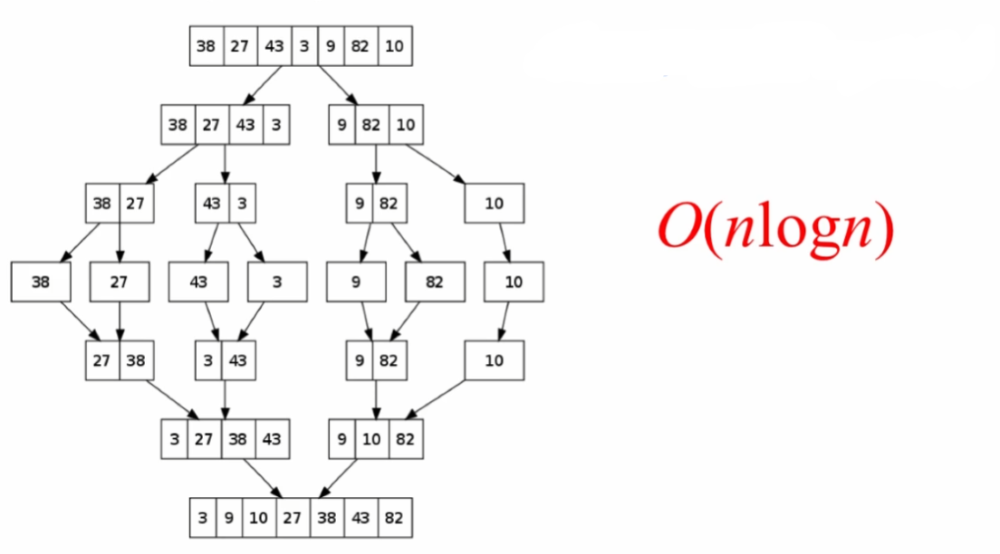
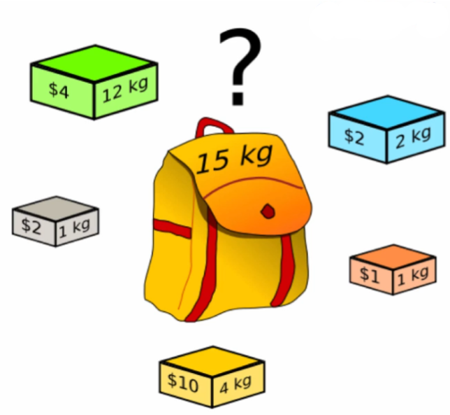

# 6강: 알고리즘의 복잡도 (Complexity of Algorithms)

> 복잡도: 알고리즘이 실행됨에 있어, 문제의 크기 (일반적으로 데이터 원소의 개수)가 커짐에 따라 얼마나 큰 시간을 (또는 공간을) 요구하는가

▷ 시간 복잡도: 문제의 크기와 이를 해결하는 데 걸리는 시간 사이의 관계<br>
▷ 공간 복잡도: 문제의 크기와 이를 해결하는 데 필요한 메모리 공간 사이의 관계

## 시간 복잡도 (Time Complexity)

▷ 평균 시간 복잡도(Average Time Complexity): 임의의 입력 패턴을 가정했을 때 소요되는 시간의 평균<br>
▷ 최악 시간 복잡도(Worst-case Time Complexity): 가장 긴 시간을 소요하게 만드는 입력에 따라 소요되는 시간


## 점근 표기법 (asymptotic notation)
- 함수의 증가 양상을 대강 파악할 수 있도록 하는 목적
- 대표적으로 `big-O notation`
- 어떤 함수의 증가 양상을 다른 함수와의 비교로 표현(알고리즘의 복잡도를 표현할 때 흔히 쓰임)

### 선형 시간 알고리즘 (O(n))
* 예: `n`개의 무작위로 나열된 수에서 최댓값을 찾기 위해 선형 탐색 알고리즘 적용
* Average case: O(n)
* Worst case: O(n)

### 로그 시간 알고리즘 (O(log n))
* 예: `n`개의 크기 순으로 나열된 수에서 특정 값을 찾기 위해 이진 탐색 알고리즘 적용



### 이차 시간 알고리즘 (O(n^2))
* 예: 삽입 정렬(Insertion Sort)


* Best case: O(n) // 이미 정렬된 상태 또는 대부분 정렬 된 상태
* Worst case: O(n^2) // 역순으로 정렬된 상태


### 병합 정렬(Merge Sort) 알고리즘 (O(n log n))
- 입력 패턴에 따라 정렬 속도에 차이가 있음
- 정렬 문제에 대해 **`O(n log n)`보다 낮은 복잡도를 갖는 알고리즘은 존재할 수 없음**이 증명됨




### Knapsack Problem (배낭 문제)

___

## 다지선다형 문제 풀어보기
### 객관식 1
- N 개의 원소로 이루어진 배열이 있습니다. 이 배열을 반씩 나누어 각각 정렬한 뒤 병합 (merge) 하는 방법을 통해서, 소위 "divide-and-conquer" 방법으로 정렬할 수 있습니다. 이러한 방법으로 데이터를 정렬하는 알고리즘을 병합 정렬 (merge sort) 알고리즘이라고 부릅니다. 병합 정렬 알고리즘의 복잡도를 big-O 점근 표기법으로 표기한 것으로 다음 중 알맞은 것을 고르세요.
<pre>
① O(logN)
② O(N)
③ O(NlogN)
④ O(N^2)
⑤ O(N^3)

<details><summary>정답보기</summary><div markdown="1">③ O(NlogN)</div></details></pre>

### 객관식 2
- 이미 크기 순으로 정렬되어 있는 N 개의 원소를 가지는 배열로부터, 입력으로 주어진 데이터가 배열 내에 존재하는지, 또한 존재한다면 몇 번째 원소인지를 탐색하는 방법으로서, 배열의 가운데 원소와 입력 데이터를 비교하고 그 데이터와 같은 원소가 존재할 수 없는 절반의 배열을 버리는 방식을 택할 수 있습니다. 이러한 탐색 방법을 이진 탐색 (binary search) 이라고 부릅니다. 이진 탐색 알고리즘의 복잡도를 big-O 점근 표기법으로 표기한 것 중 다음에서 알맞은 것을 고르세요.
<pre>
① O(logN)
② O(N)
③ O(NlogN)
④ O(N^2)
⑤ O(N^3)

<details><summary>정답보기</summary><div markdown="1">① O(logN)</div></details></pre>

### 객관식 3
- N 개의 원소가 무작위 순서로 늘어서 있는 배열 내에, 입력으로 주어진 데이터가 존재하는지, 그리고 존재한다면 몇 번째 위치에 존재하는지를 알아내기 위하여 배열을 처음부터 시작해서 원소를 하나씩 입력 데이터와 비교하는 방법을 적용할 수 있습니다. 이러한 탐색 방법을 선형 탐색 (linear search) 이라고 부릅니다. 선형 탐색 알고리즘의 복잡도를 big-O 점근 표기법으로 표기한 다음 중 알맞은 것을 선택하세요.
<pre>
① O(logN)
② O(N)
③ O(NlogN)
④ O(N^2)
⑤ O(N^3)

<details><summary>정답보기</summary><div markdown="1">② O(N)</div></details></pre>


### 객관식 4
- N 개의 수가 입력으로 주어진다고 할 때, 모든 원소들 사이의 대소 관계를 비교하여 N X N 행렬로 나타내고자 합니다. 이 문제를 풀기 위하여 모든 원소의 쌍에 대하여 대소 관계를 비교하여 그것을 행렬에 채우는 방법을 택한다고 할 때, 이 알고리즘의 복잡도를 big-O 점근 표기법으로 표기한 다음 중 알맞은 것을 선택하세요.
<pre>
① O(logN)
② O(N)
③ O(NlogN)
④ O(N^2)
⑤ O(N^3)

<details><summary>정답보기</summary><div markdown="1">④ O(N^2)</div></details></pre>


### 객관식 5
- N 행 N 열의 정사각행렬 A 와 B 가 주어진다고 할 때, 이 두 행렬의 곱 (product) 인 N X N 행렬 C 를 계산하기 위하여 다음과 같은 방법을 쓸 수 있습니다.
```
for i in range(N):
    for j in range(N):
        C[i][j] = 0
        for k in range(N):
            C[i][j] += A[i][k] * B[k][j]
```
- 이러한 알고리즘을 이용하여 행렬의 곱셈을 행할 때, 이 행렬 곱셈 (matrix multiplicaiton) 알고리즘의 복잡도를 big-O 점근 표기법으로 알맞게 표기한 것을 아래 보기에서 선택하세요.
<pre>
① O(logN)
② O(N)
③ O(NlogN)
④ O(N^2)
⑤ O(N^3)

<details><summary>정답보기</summary><div markdown="1">⑤ O(N^3)</div></details></pre>
